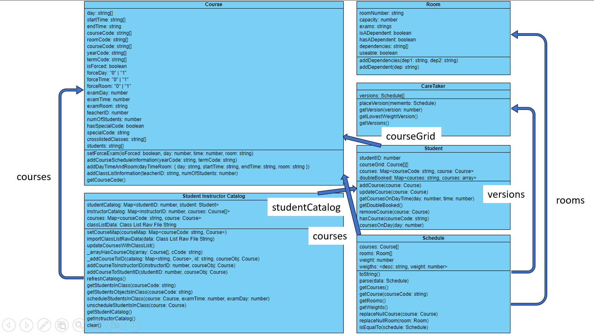

# Class Diagram

# Notes
## Course
- The course class is the main class that contains all the information about a course.
- It contains when a class meets, its instructor, and information about the final exam.

## Room
- The room class contains information about a room, such as its number, capacity, and scheduled exams.
- It also contains information about the room's dependents and if it's "usable".

## Student
- The student class contains information about a student, such as their name, id, and the courses they are taking.
- Additionally, the student class is used to determine if a student is double booked.

## Schedule
- The schedule class contains information about a schedule. This includes the courses, rooms, and weights associated with the schedule.

## Caretaker
- The caretaker class contains an array of Schedules and their associated weights.
- This class is used to pick the best schedule.

## Student Instructor Catalog
- The Student Instructor Catalog class contains information about students and instructors.
- This class manages the interactions between students and instructors.