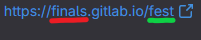
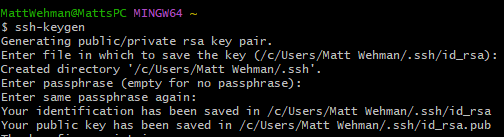
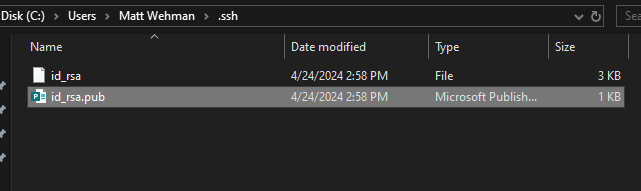
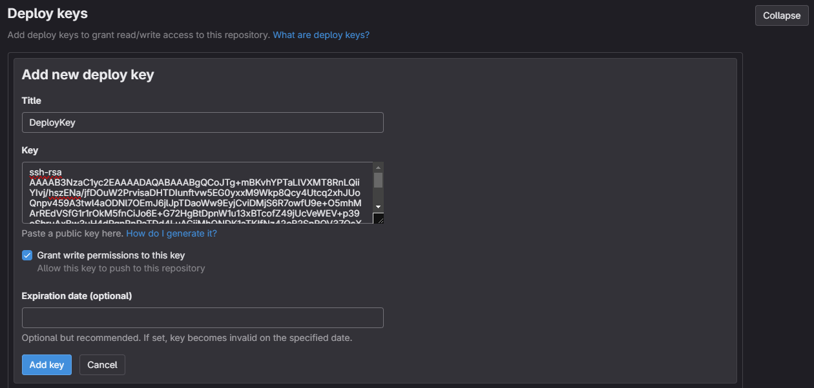
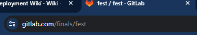

<details><summary>Deploying to your own repo</summary>

## Introduction
This section of the documentation will guide you through deploying the Final Exam Scheduler code to a completely new repo. Use this section if you want to replace the FEST repo with a new deployment repo.

## Setting up the new repo

First, we need to create a new repo and possibly create a new group. The group that your repo is in affects that Gitlab Pages URL that is deploying your code.

### Considerations when creating a new group

When creating a new group, the most important option is your **Group URL**. This URL will be used to generate the first portion of your Gitlab Pages URL. Consider the following generated GitLab Pages URL:



The portion underlined in red is the URL of the group, while the portion underlined in green is the name of the repo you are deploying from.

### Creating the repo

The name of your repo affects the final URL of the Gitlab page generated by it (see next section for more details). When creating the repo, let Gitlab automatically generate a ReadMe file. This will create a placeholder main branch that we will need later in the process. Also, make sure that the repo your create is Private. Once the repo is created, we will want to allow force pushes to the main branch. To do this, navigate to **Settings** -> **Repository** -> **Protected Branches** and enable the "Allowed to force push" setting on your main branch.

### Setting up deploy key

The first thing we will setup for our new repo is a deploy key. A deploy key will allow the Final Exam Scheduler repo to access our new deployment repo. 

Open a git bash terminal and enter the command `ssh-keygen`. You don't need to rename the file or create a password for it.



_Example git bash ssh-keygen command_

Next, navigate to where the generated file was stored. It should by default be stored at `C/Users/[Your Username]/.ssh`. There should be two files in that folder, and one should have the `.pub` file extension. If both files look the same, make sure you have file extensions turned on in your file managers **View** settings.



_Generated ssh keys_

Copy the text from the file with the `.pub` file extension, then head back to your deployment repo. Navigate to **Settings** -> **Repository** and expand the **Deploy keys** section. Click the "add new key" button. Name your deploy key whatever you want, then paste the text you copied earlier into the "Key" section. Finally, you need to enable the "Grant write permissions to this key" option so the Final Exam Scheduler repo will be able to push to your repo.



_Adding a deploy key_

### Configuring pages

**DO THIS SECTION AFTER YOU HAVE PUSHED TO THE NEW REPO AT LEAST ONCE FROM FINAL EXAM SCHEDULER**

Once the pipeline is completed, go to the **Deploy** -> **Pages** section of your repo. Uncheck the "Use unique domain" option and save your changes. This will result in a nicer URL and allow the site to properly build the service worker. Next, go to the **General** settings of your repo, and expand the **Visibility, project features, and permissions** section. Within that section set the **Pages** option to **Everyone**. Run the pipeline again, then navigate to your publicly accessible webpage!! With that you have finished this guide!

## Updating Final Exam Scheduler Repo

### Creating environment variables

We will now need to update the Final Exam Scheduler Repo to push to your new repo instead of the FEST repo.  Within the Final Exam Scheduler Repo, navigate to **Settings** -> **CI/CD** -> **Variables** then add a new variable. This variable will hold the private key that Final Exam Scheduler will use to communicate with the FEST repo. You can name this variable however you want, just make sure to remember its name for later. Use the following options when creating the variable:

- `Type`: Variable (default)
- `Environments`: All (default)
- `Protect variable`: Unchecked
- `Mask variable`: Unchecked
- `Expand variable reference`: Unchecked
- `Key`: Any name you want that is not already taken
- `Value`:  The text from the private key generated by `ssh-keygen`. (File that does **NOT** have the `.pub` extension)

Now we need to create another variable to hold the new repo's deploy pipeline. Use the same options as listed above except use a new key name and use the following string as your value:

```
image: node:lts
before_script:
  - npm ci
pages:
  stage: deploy
  cache:
    paths:
      - node_modules/
  variables:
    NODE_ENV: production
    PUBLIC_URL: https://groupURL.gitlab.io/repoName
  script:
    - npm install
    - unset CI
    - npm run build
    - cp dist/index.html dist/404.html
    - cp -a dist/. public/
  artifacts:
    paths:
      - public
```

You will need to update the `PUBLIC_URL` section of the string to use your group's URL and repo name. These can be found by looking at the URL when on your new repo's project page.



_For this project, my group url is "finals" and its repo name is "fest". So my PUBLIC_URL would be https://finals.gitlab.io/fest_

## Updating the pipeline

Now we need to update the `.gitlab-ci.yml` file in the Final Exam Scheduler repo to use your newly created environment variables. Update `"$CI_SSH_ACCESS"` on line 32 of the pipeline to use the variable that you created to store the private key. Then update `"$DEPLOY_PIPELINE"` on line 39 to the variable you created to store the new pipeline. Finally, update `git@gitlab.com:finals/fest.git` to use your GitLab group's URL and repo name. After these updates, the Final Exam Scheduler repo should now push changes to the new repo that you created. Run the pipeline and allow it to finish. To finish this guide, head back to the "Configuring Pages" section of this documentation to complete the final steps.

</details>

<details><summary>Deploying to the FEST repo</summary>

## Introduction
This section of the documentation will guide you through deploying to the FEST repo. Follow this section if you want to maintain the current setup of having separate repos for development and deployment. 

## Setting up a new development repo 

First, we will need a new development repo to use in place of the Final Exam Scheduler repo. You will need to copy the code from the Final Exam Scheduler repo and add it to your new repo. **The rest of this section will assume that your new repo is an exact copy of the current Final Exam Scheduler repo!**

### Add environment variables

The next thing we need to do is set the environment variables of the new repo. In the Final Exam Scheduler repo, navigate to **Settings** -> **CI/CD** then expand the variables section. Add both of the environment variables found there to your new repo. When adding the variables, make sure to set the following options for each variable:

- `Type`: Variable (default)
- `Environments`: All (default)
- `Protect variable`: Unchecked
- `Mask variable`: Unchecked
- `Expand variable reference`: Unchecked
- `Key`: The exact same key from whatever variable you are copying from the Final Exam Scheduler repo
- `Value`:  The exact same value from whatever variable you are copying from the Final Exam Scheduler repo

## Running the deployment script

Your repo should now have the ability to push to the FEST repo. 

The pipeline will only deploy to the FEST repo under the following conditions:

1) The pipeline tests pass
2) The cause of the pipeline running is committing to main or making a merge request to main.

Test that your pipeline is able to deploy by making a small commit to the main branch of your new repo. The pipeline should run both the "unit test" and "deploy" sections with no errors. If the error message `fatal: --unshallow on a complete repository does not make sense` occurs while deploying, then delete the `-- unshallow` tag from the `git fetch` command on line 38 of the pipeline file.

Once this pipeline successfully finishes open up the FEST repo. You should see a pipeline running that will generate the Gitlab Page. The commit message that caused the pipeline to run should be "pipeline push" authored by the user "CI Pipeline". Once this pipeline finishes the website will be updated.

</details>


<details><summary>Overview of current CI/CD structure</summary>

## Introduction

The current CI/CD process leverages separate development and deployment repos. Currently, all of the development happens on the Final Exam Scheduler repo and the Gitlab Page deployment is handled by the FEST repo. This structure was conceived out of necessity rather than convenience. The Final Exam Scheduler's repo naming structure does not let it deploy a Gitlab page on its own, so we needed a way to circumvent that issue. The goal of this documentation section is to describe the responsibilities of each repo and how they connect.

## The deployment repo

The FEST repo is only used to deploy our Gitlab page. We created a `Deployment Token` for this repo that the Final Exam Scheduler repo uses to pushes changes to the FEST repo. Once these changes are pushed, the FEST repo will run the pipeline that was within the commit that was pushed to it. Under the "Deploy stage explanation" section of this documentation I describe how this pipeline is injected into the commit by the development repo.

### The deployment pipeline

The deployment pipeline only has a single stage; pages. We are assuming that if this pipeline is running, then the code has already been unit tested by the development repo's pipeline. The pages stage of the pipeline is very simple and just defines a URL then builds our program.


## The development repo

Like stated in the intro, the Final Exam Scheduler repo is where all of the development happens. This is the repo that will hold of the current feature branches, issues, milestones, and merge requests. It is essentially an ordinary repo except for how the pipeline is configured.

### The development pipeline

The development pipeline has two stages: `unit test` and `deploy`. The unit test stage is self explanatory. It runs whenever a commit is pushed or merge request is made to any branch. The pipeline becomes more interesting when interacting with the `main` branch. 

#### Deploy stage explanation 

The only way that the deploy stage of the pipeline runs is if a commit or merge request is made to the main branch of the repo (assuming the unit tests pass). The deploy stage does not generate a Gitlab page itself. It actually connects to the deployment repo, replaces the pipeline file of Final Exam Scheduler's main branch commit, and then force pushes that commit to the FEST repo. 

The start of this process is connects to the FEST repo from our pipeline.  This is done by the following code within the pipeline:


The script first creates git credentials so we can have an author for our commit. Lines 32-36 set up our ssh access to the FEST repo, and line 37 adds the FEST repo as the target for our commit. The variable `CI_SSH_ACCESS` is a Deploy Token from the FEST repo that allows us to connect using ssh.

Next, we need to modify our commit to perform some cleanup and replace the pipeline file. This is done by the following code:


We first fetch the last commit from the FEST repo, so our pipeline has branch information about the remote repository. Then we remove the `Manual Images` folder since those images are used for documentation that is stored only in the Final Exam Scheduler repo. Finally, we replace the current pipeline file with a different file so that the current pipeline does not run again once we push to main of the FEST repo. The last portion of the pipeline is just adding our changes, committing, and force pushing to the FEST repo's main branch.


## CI/CD diagram


</details>