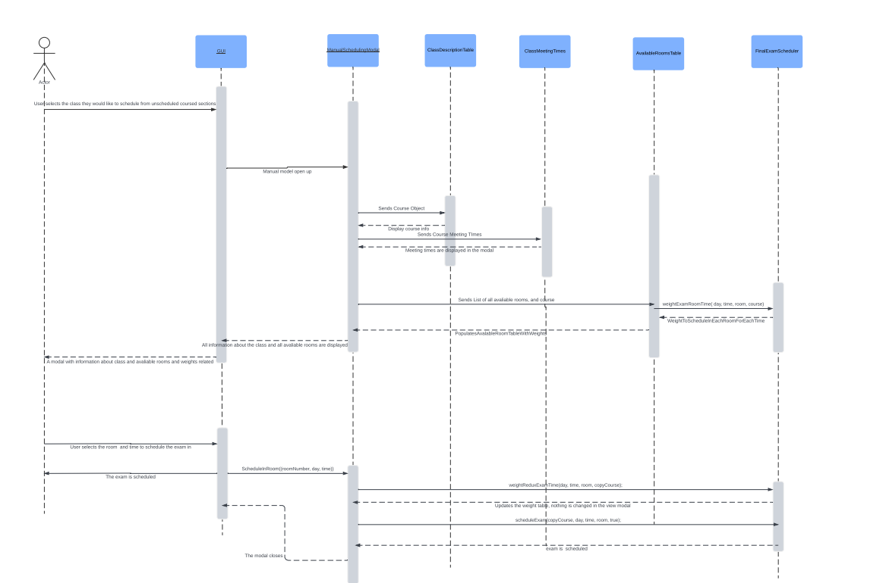
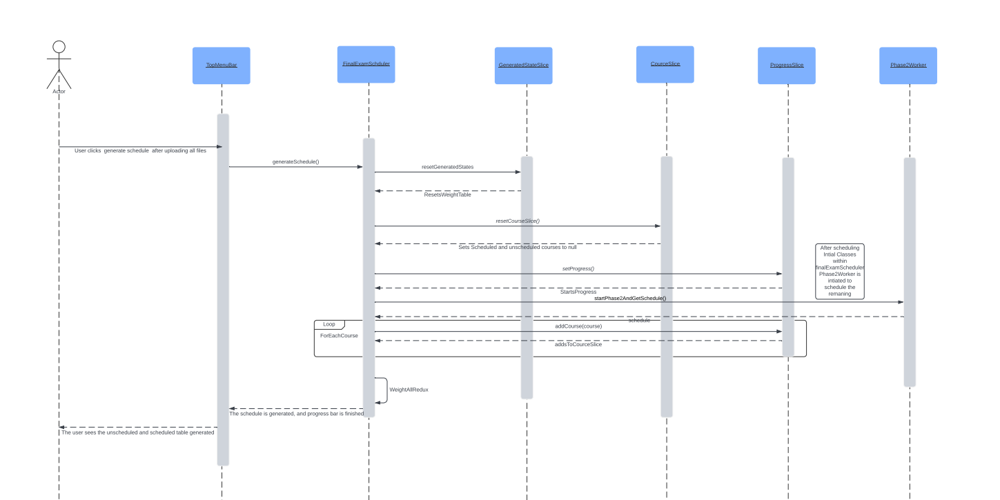
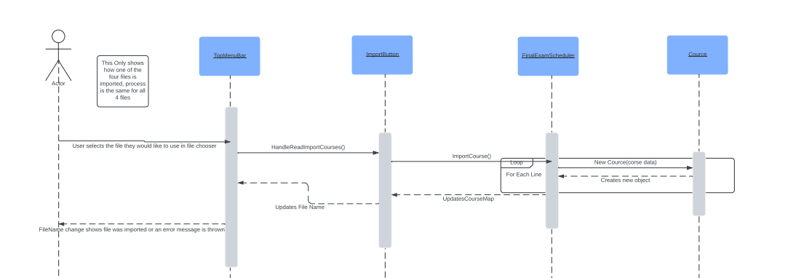
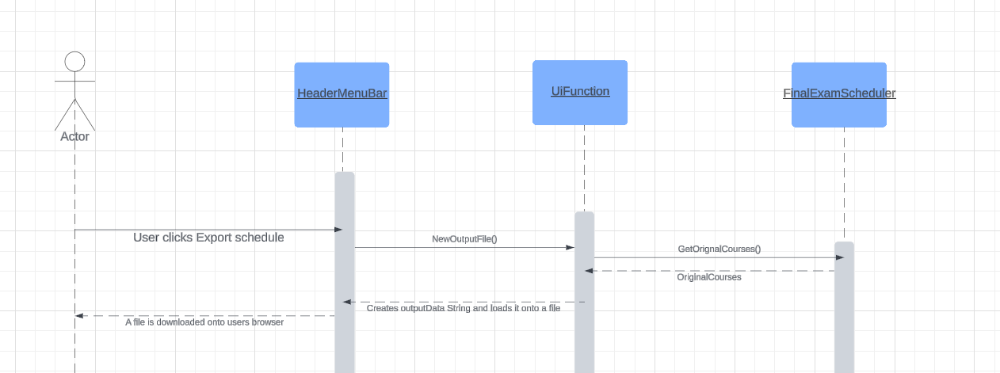

A sequence diagram depicting how React and Redux interact for manually scheduling/unscheduling a class

A sequence diagram depicting how React, Redux, and Web Worker interact for Schedule Generation

A sequence diagram depicting the class interactions for importing files

A sequence diagram depicting how React and Redux interact for exporting an exam schedule as a tsv file

**How To View in Lucid App**
https://lucid.app/lucidchart/9f99e37f-df31-4ff7-995a-1041c9e39ed4/edit?viewport_loc=254%2C4554%2C2578%2C1370%2C0_0&invitationId=inv_f9292fcf-fa77-4f1a-a241-bf0b7e6636cb
Anyone with the link can edit the sequence diagrams