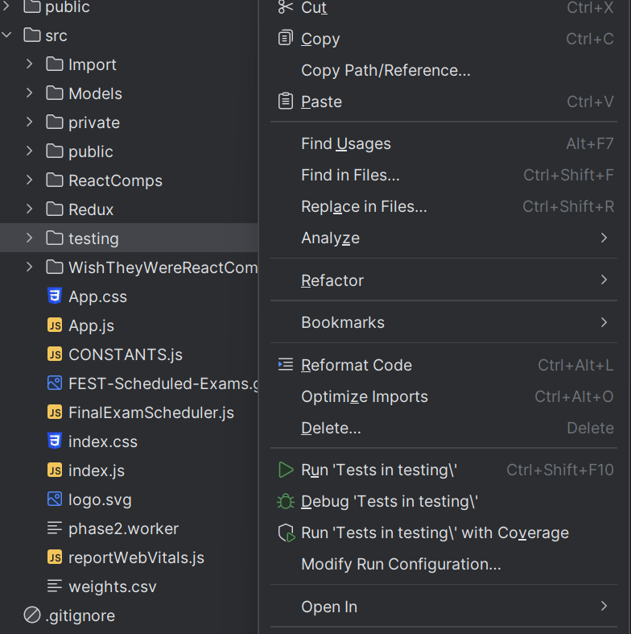

 
How to execute tests 

This section of the documentation will define how to execute our test suite. Before attempting to run these tests, make sure you have followed the build wiki and can build the project.

## Test execution with the console

These console commands will work in any code editor. Make sure your console is currently pointed at the root of the repo while running these commands.

**To run all of the tests**, use the following console command:

`npm test` 

**To run the tests in one file**, use the following console command:

`npm test [file]`

Here is an example of running a test in a specific file:

`npm test usableRoomsTests.test.js`

## Test execution with Jet Brains products

IntelliJ and Webstorm allow you to run tests with built in GUI functions. 

**To run all tests:**

1) Right Click the testing folder

2) Click "Run tests in testing\" option

**To run the tests in a single file:**

1) Select the test file you want to run

2) Click the "play" icon to run the tests in the file

 
 Testing Structure 

This section will document where are tests are located, how they are structured, and how we manufacture/import test data. 

## Test Structure

Each set of tests has its own own folder within the root `src/testing/` folder. A set of tests consists of the jest test file and a folder that contains test data.

_Example set of tests_

Each folder within the `TestFiles` folder contains data for different tests.

_Data for a single test_ 

## Importing data into a test

Importing specific data to use in a test is pretty easy. All tests use the `testImport_Act(folderName)` method to import test data into the program. The first thing you will need to do is add that method to your test file and update the file paths in it. 

_Example `testImport_Act()` method, make sure to update these file paths when adding a new test_

Within each test, just call `testImport_act(folderName)` with the name of the folder that holds the data you need.

_Calling import method in a test_

## Manufacturing Data

This section will describe how to artificially manufacture test data for an example test case. You can manufacture test data by making by creating new courseSchedule, classList, rooms, and special cases files.

### Example Test Data

Lets say you want to make sure that the scheduling an exam in a room that is too small generates a scheduling conflict. 

First, you need to create a `rooms.txt` file with a small room. The file could look like this:

`room_nm	capacity	room_dep1	room_dep2`

`TESTROOM	1`

First, you need to create a `courseSchedule.txt` file that places a course in that room. The file could look like this:

`yr_cde	trm_cde	room_cde	crs_cde	monday_cde	tuesday_cde
wednesday_cde	thursday_cde	friday_cde	saturday_cde	sunday_cde	begin_tim	end_tim	examRoom	examDay	examTime	force_time`

`2022	Q1	TESTROOM	TST   3011 001	M		W	R			1/1/00 16:00	1/1/00 16:50	TESTROOM	M	08:00	1`

We need to force this class to be scheduled into the test room we created to the course doesn't get scheduled with actual algorithm.

Finally, create a `classList.txt` file that places two students in the course so the course size is larger than the room it will be scheduled in.

`id_num	yr_cde	trm_cde	crs_cde	lead_instructr_id	crs_enrollment`

`student1	2022	Q1	TST   3011 001	instructor1	1`

`student2	2022	Q1	TST   3011 001	instructor1	1`

Importing all of these files will now artificially schedule an exam in a room that is too small for it. You can then use this data to ensure that the algorithm is generating a room too small conflict after the generation!

 
 Redux Testing 

This section will go over how to test our redux state slices. It will cover how to test redux state on initial schedule generation and when a course in manually moved in the GUI. It will also cover the library that we use to facilitate redux testing, and how we modify the `testImport_Act()` method to schedule in redux.

## Redux specific testing structure changes

### Modification to `testImport_act()`

The first thing we need to do for redux testing is add the line

`weightAllRedux()`

to the end of the `testImport_act()` method. This will make sure that the redux slice will weight all of our exam conflicts after the forced courses are scheduled.

### Chai-waitfor

Redux slices don't immediately reset between tests, so we need a way to ensure that slice state isn't being shared between tests. That is where the Chai-waitfor library comes in. Chai-waitfor is part of the Chai testing library and allows us to halt a test until a certain state is reached. In our case, we will use it to ensure our redux slice is empty before starting the rest of the test.

To get started import Chai-waitfor with the following code:

`import chai from "chai";`

`const { expect } = chai;`

`import chaiWaitFor from "chai-wait-for";`

`chai.use(chaiWaitFor);`

**Next,** we need to configure Chai-waitfor so it knows how long to wait for a slice to reset. Add this function to your test code:

`const waitFor = chaiWaitFor.bindWaitFor({`

  `timeout: 4000,`

  `retryInterval: 100,`
`});`

**Finally,** use the library to wait for your slice to reset at the start of each test. For example, if you are testing the student double booked conflict slice, then you would add this line to the start of your test:

`await`
`waitFor(store.getState().generatedWeights.studentDoubleBooked.instances.length,).to.equal(0);`

This will ensure that our redux state is empty before starting the rest of the test.

## Testing after initial generation

Testing the redux state after the initial schedule generation is actually pretty easy. Since we already added 'weightAllRedux()' to `test_importAct()` our tests will automatically update our redux to hold all of our generated conflicts. 

For example, if we are testing if double booked students are being added properly after initial generation, then we can use the following `expect` statements to determine if the proper conflicts are added:

`const state = store.getState();`

`const doubleBookedSlice = state.generatedWeights.studentDoubleBooked;`

`// This initially ensures that the correct amount of conflicts are added`

`expect(doubleBookedSlice.instances.length).to.equal(3);`

You can also test more in depth by looping through each instance to make sure that they match your expectations.

## Testing with manually moved courses

Testing redux changes with manually scheduled and unscheduled courses is also not too hard. Lets say you want to test if manually scheduling a course correctly generates a student double booked conflict.

First you would want to create a `courseSchedule.txt` that schedules two exams at different times. Then you need to create a `classList.txt` that puts a student in both classes. Now that your data is setup, you can start writing you test code. 

After importing your data manually, unschedule an exam using the `unscheduledExam()` method, then get that classes data like this:

`unscheduledCourse("CLASS_B_");`

`const conflictCourse = getCourse("CLASS_B_");`

The method `weightReduxExamTime(day, time, room, class)` handles weighting exams when they are manually scheduled and pushes generated conflicts to the redux slice. So, if we want to test that manually scheduling our exam would add a conflict to redux, then we can do this:

`weightReduxExamTime(0, 0, getRooms().get("DBS2"), conflictCourse);`

`const state = store.getState();`

`const doubleBookedSlice = state.generatedWeights.studentDoubleBooked;`

`expect(doubleBookedSlice.instances.length).equals(1);`

This code will ensure that a single student double booked conflict was generated after rescheduling an exam.

 
 Integration Testing 

This section will cover how we conduct integration tests of our system to ensure classes are being placed properly. 

## Creating the service worker

Service workers can only run in a web environment, which makes it challenging to integration test a system the relies on them like ours. Luckily, we found an npm package called JSDOM-worker that allows us to create a service worker that can run within Node. To create a service worker first import `jsdom-worker` into your jest file. Next, add the following code to the `testImport_Act()` method in your jest file:

`const code = fs.readFileSync("src/phase2.worker");`

`let worker = new Worker(URL.createObjectURL(new Blob([code])));`

This will create the service worker using JSDOM-worker that we will be using in our integration tests. Now we need to pass this new worker into `FinalExamScheduler.js` so it is calling the correct worker. We can achieve this by passing `worker` in as the last argument to `importAllOnTestStart()`. Along with importing all of our files like normal, that method will also replace the browser only service worker with the worker we passed into it!

## Generating a schedule

Since this is an integration test, you will probably be using real data instead of manufactured data that just forces exams into specific spots. This means that we will want to actually use the `generateSchedule()` method within `FinalExamScheduler.js` to generate a schedule, wait for schedule generation to finish, then test something.

Here is an example integration test setup:

1) `await testImport_Act(folderName);` (Make sure you create the service worker within the import method!)

2) `generateSchedule();` Begins schedule generation

3)  `await waitFor(() => {
            expect(store.getState().progress.progress).toEqual(-1);
        });` This code will ensure that the schedule has been finished before moving onto the tests

With that setup done, you can now write any assertions you want to ensure whatever you are testing is working properly. 

_Tip:_ If you have large integration tests, then jest may timeout before your schedule generates. To circumvent this, you can add `jest.setTimeout(300000);` to the top of your file to ensure jest does not timeout before your schedule has generated.

 
 Possible Limitations 

## Service Worker Unit Testing

Currently we have no way to unit test functions within the service worker. We are able to run integration tests on the service worker to see its final output, but we are unable to call functions within the service worker directly. The only way we can think to unit test service worker function is copying the worker file to a pure JS file during the testing script.

